# Shoponn
### Deployment site
<a href="https://shoponn.herokuapp.com/" target="_blank">https://shoponn.herokuapp.com/</a>

### Required environment variables
<ul>
<li>NODE_ENVIRONMENT=[production or development]</li>
<li>SECRET_KEY=[secretkey]</li>
<li>DATABASE_URL=[mongodb://localhost:27017/test]</li>
<li>BRAINTREE_PUBLIC_KEY=[************]</li>
<li>BRAINTREE_PRIVATE_KEY=[***********]</li>
<li>BRAINTREE_MERCHANT_ID=[***********]</li>
</ul>

### At first install all the dependencies
<ol>
<li>inside root package, run</li>
<li>"npm install" ***[this will install all the dependencies for backend]***</li>
<li>move to cliend package, "cd client/", then run</li>
<li>"npm install"  ***[this will install all the dependencies for react frontend]***</li>
</ol>

### To start the project in development mode
<ol>
<li>inside root package, run</li>
<li>"npm start dev"</li>
<li>move to cliend package, "cd client/", then run</li>
<li>"npm start"</li>
</ol>

### To start the project in production mode
<ol>
<li>make sure that NODE_ENVIRONMENT is set to production in .env file</li>
<li>inside root package, run</li>
<li>"npm run prod"</li>
<li>project will be available to run at localhost</li>
</ol>

### Samples

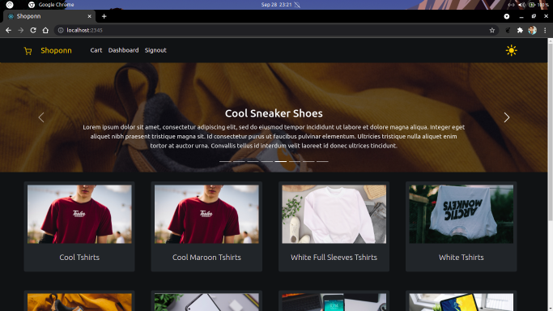
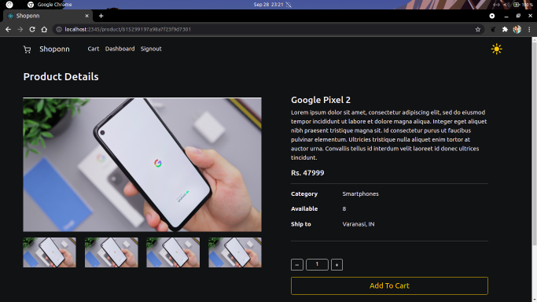
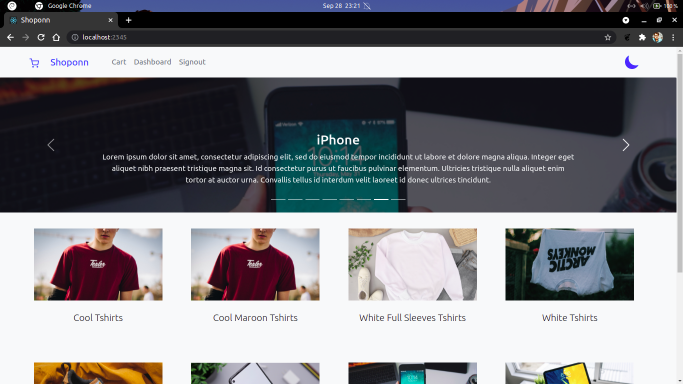
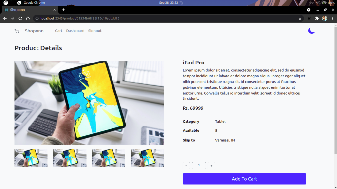
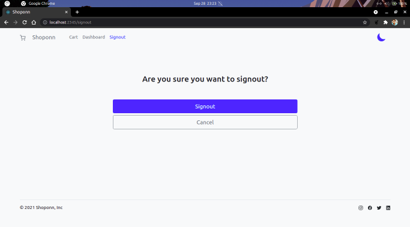

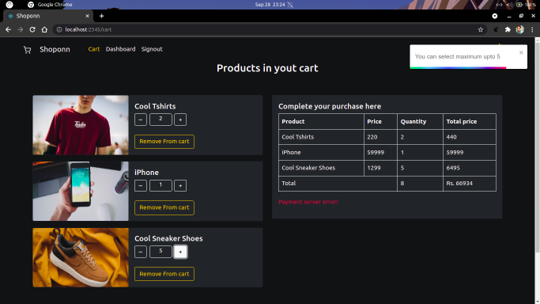
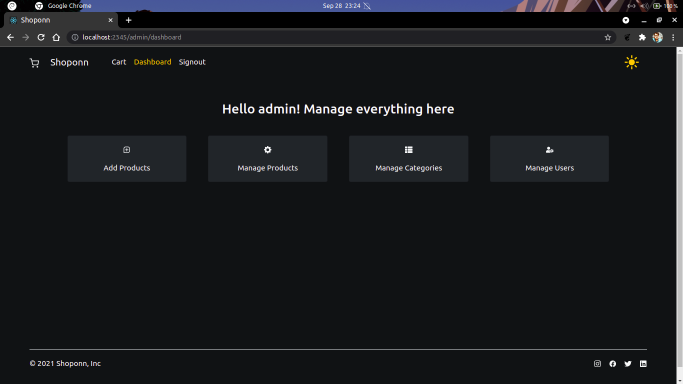
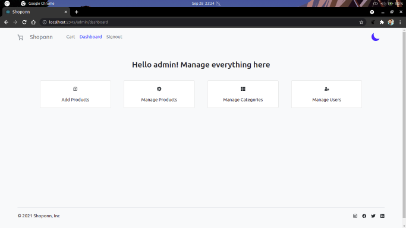
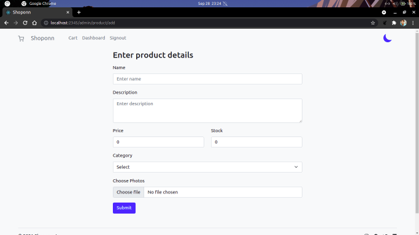
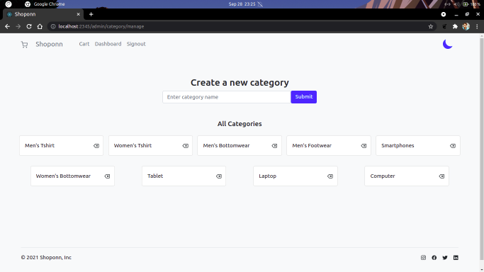
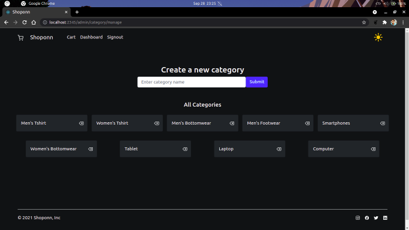
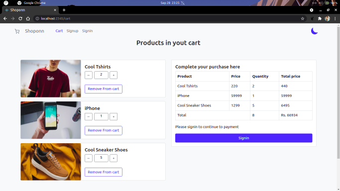
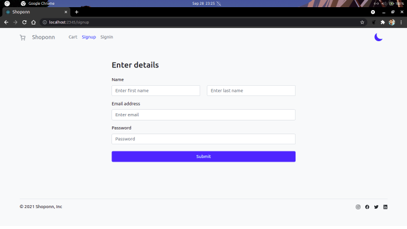

